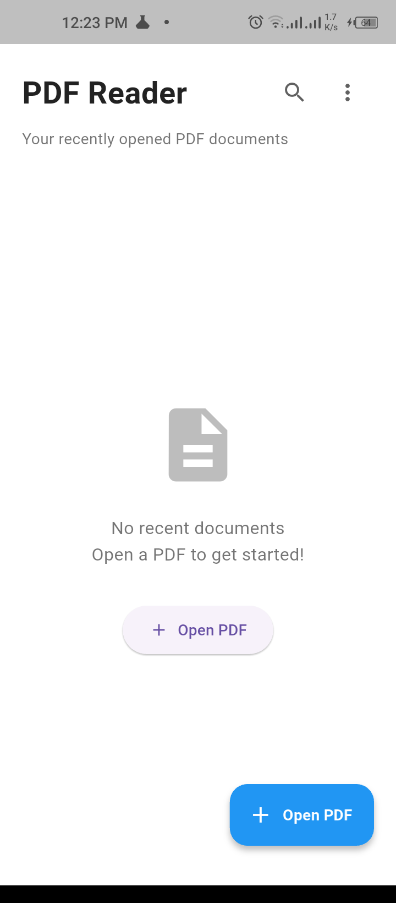
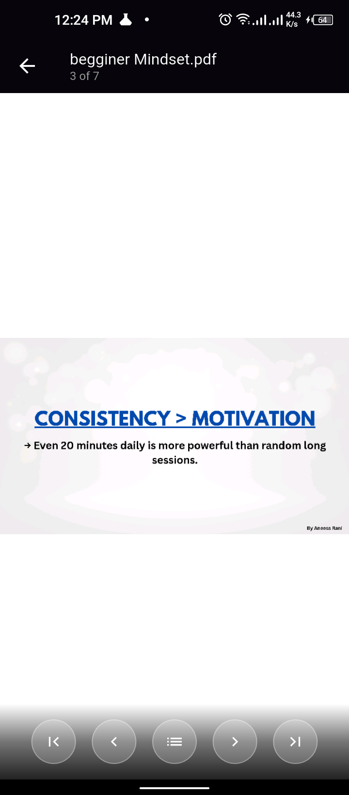
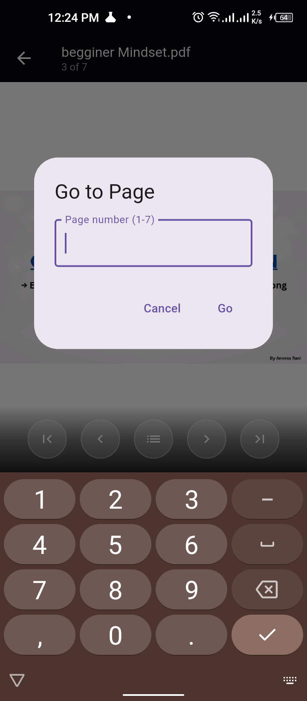
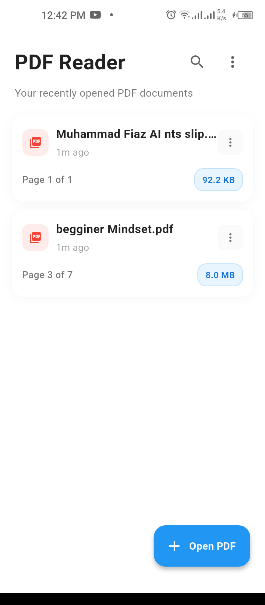
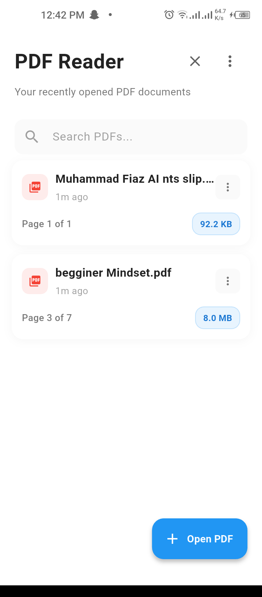
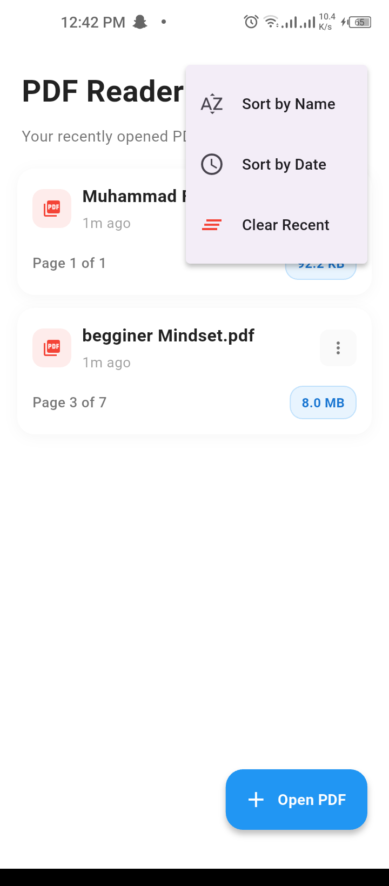
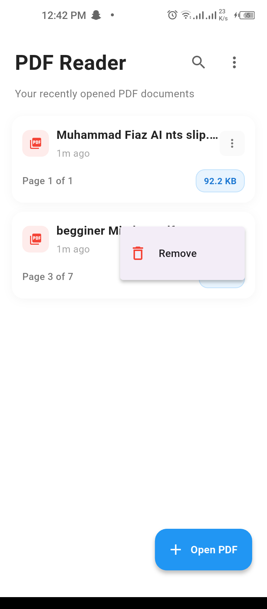

# 📖 PDF Viewer App

<div align="center">
  <h3>A Modern, Clean & Responsive PDF Viewer for Flutter</h3>
  <p>Built with Flutter • Material Design • Clean Architecture</p>
  
  [](https://flutter.dev/)
  [](https://dart.dev/)
  [](LICENSE)
  [](#developer)
</div>

<div align="center">
  <h4>🎯 Developed by <strong>Muhammad Fiaz</strong></h4>
  <p><em>Flutter Developer | Mobile App Enthusiast | Clean Code Advocate</em></p>
</div>

---

## 📱 Screenshots

<div align="center">
  
  
  
  
</div>

<div align="center">
  
  
  
</div>

---

## ✨ Features

### 📱 **Core Features**
- **📂 PDF File Selection**: Seamlessly pick PDF files from anywhere on your device using the native file picker
- **📄 Recent Documents**: Smart tracking of recently opened PDFs with automatic cleanup of missing files
- **💾 Reading Progress**: Automatically saves and restores your reading position for each document
- **🔍 Search Functionality**: Quickly find documents by name or file path
- **📊 Document Management**: Sort documents by name, date, or size

### 🎯 **PDF Viewer Features**
- **📖 Smooth Navigation**: Swipe between pages or use navigation controls
- **🎯 Page Jumping**: Quick jump to any specific page number
- **📏 Page Information**: Always see current page and total page count
- **🖥️ Full-Screen Mode**: Immersive reading experience with hidden UI
- **👆 Touch Controls**: Tap anywhere to toggle control visibility
- **🔄 Auto-Resume**: Returns to your last read page when reopening documents

### 🎨 **UI/UX Features**
- **✨ Modern Design**: Clean, Material Design-inspired interface
- **📱 Responsive Layout**: Adapts beautifully to different screen sizes
- **🎭 Compact Cards**: Optimized document cards with essential information
- **🌟 Enhanced Menu**: Improved three-dot menu with better accessibility
- **💫 Smooth Animations**: Fluid transitions and loading states
- **🚫 Empty States**: Helpful guidance when no documents are available
- **⚡ Performance**: Optimized rendering and memory management

---

## 🏗️ Architecture

Built with **Clean Architecture** principles, ensuring maintainable and scalable code:

```
📁 lib/
├── 🚀 main.dart                 # App entry point
├── 📊 models/                   # Data models
│   └── pdf_document.dart        # PDF document model with formatting
├── 🔧 services/                 # Business logic services  
│   ├── storage_service.dart     # SharedPreferences management
│   └── file_service.dart        # File operations & validation
├── 🎮 controllers/              # State management (ChangeNotifier)
│   ├── pdf_controller.dart      # PDF viewer state & logic
│   └── home_controller.dart     # Home screen state & operations
├── 📱 screens/                  # UI screens
│   ├── home_screen.dart         # Main document list screen
│   └── pdf_viewer_screen.dart   # PDF viewing interface
└── 🧩 widgets/                  # Reusable UI components
    ├── document_card.dart       # Enhanced compact document cards
    ├── empty_state.dart         # Beautiful empty state widget
    └── pdf_controls.dart        # PDF navigation controls
```

---

## 📦 Dependencies

### **Core Dependencies**
```yaml
dependencies:
  flutter: sdk: flutter
  
  # PDF viewing
  flutter_pdfview: ^1.3.2      # High-performance PDF rendering
  
  # File handling
  file_picker: ^8.0.7          # Native file picker integration
  path_provider: ^2.1.4        # System path access
  
  # Storage
  shared_preferences: ^2.3.2   # Local data persistence
  
  # UI
  cupertino_icons: ^1.0.8      # iOS-style icons
```

### **Dev Dependencies**
```yaml
dev_dependencies:
  flutter_test: sdk: flutter
  flutter_lints: ^5.0.0        # Code quality & best practices
```

---

## 🚀 Installation & Setup

### **Prerequisites**
- Flutter SDK (3.8.1 or higher)
- Dart SDK (3.0 or higher)
- Android Studio / VS Code
- Android SDK / Xcode (for device testing)

### **Quick Start**

1. **📥 Clone the repository**
   ```bash
   git clone <repository-url>
   cd pdf_viewer_app
   ```

2. **📦 Install dependencies**
   ```bash
   flutter pub get
   ```

3. **🔧 Check setup**
   ```bash
   flutter doctor
   ```

4. **🚀 Run the app**
   ```bash
   # Debug mode
   flutter run
   
   # Release mode
   flutter run --release
   ```

### **Building for Production**

```bash
# Android APK
flutter build apk --release

# Android App Bundle (recommended for Play Store)
flutter build appbundle --release

# iOS (requires Xcode and Apple Developer account)
flutter build ios --release
```

---

## 🌍 Platform Support

| Platform | Status | Features |
|----------|--------|---------|
| 📱 **Android** | ✅ Full Support | All features, native file picker, storage access |
| 🍎 **iOS** | ✅ Full Support | All features, document picker integration |
| 🌐 **Web** | ⚠️ Limited | File picker works, PDF viewing limited |
| 🖥️ **Desktop** | ⚠️ Partial | Basic functionality, file system access |

---

## ⚡ Technical Highlights

### **🎮 State Management**
- **Pattern**: ChangeNotifier with Provider pattern
- **Controllers**: Separate controllers for different features
- **Reactive UI**: Automatic UI updates on state changes
- **Memory Management**: Proper disposal of resources

### **🛡️ Error Handling**
- **Comprehensive**: File operations, permissions, and PDF loading
- **User-Friendly**: Clear error messages and recovery options
- **Graceful Degradation**: Handles missing files and corrupted PDFs
- **Permission Management**: Smart permission handling with user guidance

### **🚀 Performance Optimizations**
- **Efficient Rendering**: Optimized PDF view with flutter_pdfview
- **Lazy Loading**: Documents loaded on-demand
- **Memory Management**: Proper cleanup of large PDF files
- **Caching**: Smart caching of document metadata
- **Compact UI**: Optimized card design for better performance

### **🔒 Security & Privacy**
- **Local Storage**: All data stored locally on device
- **No Cloud**: No data transmitted to external servers
- **Permission Aware**: Minimal required permissions
- **File Validation**: Proper file type and security checks

---

## 🎯 User Experience Enhancements

### **Recent Updates**
- ✅ **Compact Card Design**: Reduced padding and optimized spacing
- ✅ **Enhanced Menu**: Better three-dot menu with improved visibility
- ✅ **Smart Layout**: Page info moved below file size for better UX
- ✅ **Code Optimization**: Removed unused files and imports for better performance
- ✅ **Error Handling**: Improved error messages and user guidance

### **Key UX Decisions**
- **Minimal Clicks**: Quick access to recently opened documents
- **Visual Hierarchy**: Important information prominently displayed
- **Consistent Design**: Material Design principles throughout
- **Accessibility**: Better contrast and touch targets
- **Performance**: Smooth animations and fast loading

---

## 🔮 Future Enhancements

### **Planned Features**
- 🔍 **Text Search**: Search within PDF content
- 🔖 **Bookmarks**: Save and organize bookmarks
- 📤 **Share**: Share PDFs with other apps
- 🌙 **Dark Mode**: Complete dark theme support
- 📝 **Annotations**: Highlight and add notes
- ☁️ **Cloud Sync**: Integration with cloud storage
- 🔐 **Password PDFs**: Support for encrypted PDFs
- 📊 **Reading Stats**: Track reading time and progress

### **Technical Roadmap**
- 🏗️ **Bloc Integration**: Migrate to Bloc for complex state management
- 🧪 **Testing**: Comprehensive unit and widget tests
- 🚀 **CI/CD**: Automated testing and deployment
- 📱 **Adaptive UI**: Better tablet and desktop support
- 🌐 **Internationalization**: Multi-language support

---

## 📊 Project Stats

- **Lines of Code**: ~1,500+ (clean, optimized)
- **Files**: 11 core Dart files
- **Dependencies**: 4 main packages
- **Platforms**: iOS, Android (primary)
- **Architecture**: Clean Architecture with MVC pattern
- **State Management**: ChangeNotifier
- **UI Framework**: Material Design

---

## 🤝 Contributing

Contributions are welcome! Please feel free to submit a Pull Request. For major changes, please open an issue first to discuss what you would like to change.

### **Development Guidelines**
- Follow Flutter/Dart style guidelines
- Maintain clean architecture principles
- Add tests for new features
- Update documentation as needed
- Ensure compatibility with target platforms

---

## 📄 License

This project is licensed under the MIT License - see the [LICENSE](LICENSE) file for details.

---

## 🙏 Acknowledgments

- **Flutter Team** for the amazing framework
- **flutter_pdfview** package contributors
- **Material Design** for the design system
- **Community** for feedback and contributions

---

## 👨‍💻 Developer {#developer}

<div align="center">
  <h3>📋 Muhammad Fiaz</h3>
  <p><em>Flutter Developer | Mobile App Specialist | Clean Architecture Advocate</em></p>
</div>

<div align="center">
  <table>
    <tr>
      <td align="center">
        <h4>🎯 Expertise</h4>
        <p>
          • Flutter & Dart<br>
          • Mobile App Development<br>
          • UI/UX Design<br>
          • Clean Architecture<br>
          • State Management<br>
        </p>
      </td>
      <td align="center">
        <h4>🛠️ Skills</h4>
        <p>
          • Cross-Platform Development<br>
          • Material Design<br>
          • Performance Optimization<br>
          • Code Quality & Best Practices<br>
          • Problem Solving<br>
        </p>
      </td>
    </tr>
  </table>
</div>

<div align="center">
  <h4>📱 This Project Showcase</h4>
  <p>This PDF Viewer App demonstrates proficiency in:</p>
  <p>
    <strong>✓ Clean Architecture</strong> • <strong>✓ State Management</strong> • <strong>✓ File Handling</strong><br>
    <strong>✓ UI/UX Design</strong> • <strong>✓ Performance Optimization</strong> • <strong>✓ Error Handling</strong>
  </p>
</div>

---

<div align="center">
  <h3>🚀 Muhammad Fiaz's Development Signature</h3>
  <div style="border: 2px solid #4CAF50; border-radius: 10px; padding: 20px; margin: 20px; background: linear-gradient(135deg, #f5f7fa 0%, #c3cfe2 100%);">
    <h2>🎯 Muhammad Fiaz</h2>
    <p><strong>Flutter Developer & Mobile App Architect</strong></p>
    <p><em>"Building beautiful, performant mobile experiences with clean, maintainable code"</em></p>
    <p>📧 Connect for Flutter development projects</p>
    <p>⭐ <strong>Specializing in:</strong> Cross-platform mobile apps, Clean Architecture, UI/UX optimization</p>
  </div>
</div>

---

<div align="center">
  <p>Made with ❤️ by <strong>Muhammad Fiaz</strong> using Flutter</p>
  <p>⭐ Star this repo if you found it helpful!</p>
  <p><em>© 2024 Muhammad Fiaz - All rights reserved</em></p>
</div>
